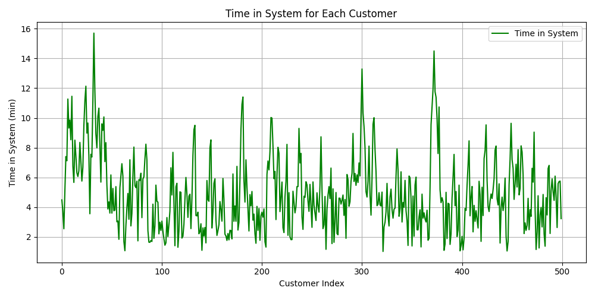

Here's the cleaned-up and fully reformatted version of your `REPORT.md` in **concise, professional Markdown**, ready to go with plot attachments:

---

# ICS 4106 - Computer Simulation and Modelling

## Group Assignment: Single-Server Bank Queue Simulation

---

## Simulation Description

This project simulates a single-server queue system representing a bank with the following characteristics:

* Inter-arrival times are uniformly distributed between 1 and 8 minutes
* Service times are uniformly distributed between 1 and 6 minutes
* Customers are served on a First-Come, First-Served (FIFO) basis
* Only one service counter is available
* The simulation processes 500 customers

---

## Performance Metrics (Simulation Output)

| Metric                              | Value   |
| ----------------------------------- | ------- |
| Total Customers                     | 500     |
| Total Simulation Time (min)         | 2248.20 |
| Average Waiting Time (min)          | 1.51    |
| Average Service Time (min)          | 3.41    |
| Average Time Between Arrivals (min) | 4.49    |
| Average Time in System (min)        | 4.92    |
| Server Utilization (%)              | 75.83   |
| Average Idle Time (min)             | 1.08    |
| Max Queue Length                    | 4       |
| Probability Customer Waits in Queue | 0.54    |
| Probability System is Idle          | 0.24    |

---

## Visualizations and Interpretations

### 1. Arrival Time vs Service Time

This scatter plot confirms that both inter-arrival and service times are correctly generated from uniform distributions. The points are evenly scattered with no visible correlation, affirming that arrivals and service durations are independent. The full range of service durations (1–6 minutes) is utilized throughout the simulation.

---

### 2. Distribution of Waiting Time

The majority of customers experience little to no waiting time. The frequency of longer waits decreases exponentially, as expected in a well-balanced system. A long tail exists, with a few customers waiting up to 10 minutes—typical in systems with random arrivals and services.

---

### 3. Server Idle Time Over Time

This chart visualizes idle times measured just before customer service begins. The idle duration fluctuates, indicating inconsistent arrival spacing. Some spikes reach up to 7 minutes, while zero-idle stretches reflect continuous customer flow. This pattern supports a stochastic, moderately busy environment.

---

### 4. Time in System per Customer

The early customers spend more time in the system, possibly due to initial buildup. As the simulation stabilizes, system time drops and becomes more consistent. Occasional spikes remain, showing that some customers still experience delays due to service variation or short bursts of congestion.

---

### 5. Histogram of Service Times

Most service durations fall between 1 and 5 minutes, peaking near 2 minutes. The distribution is right-skewed, with fewer customers experiencing longer service times. The KDE overlay smooths this view, reinforcing that short service durations dominate.

---

### 6. Number of Customers in System Over Time

This time series shows the number of customers in the system at any moment. The line fluctuates mildly, rarely exceeding 4 customers, aligning with the maximum queue length metric. Temporary buildups occur but are resolved quickly, suggesting system stability.

---

### 7. Server Status Over Time

The server remains busy for most of the simulation, with short idle periods in between. High utilization is evident in the long stretches of “busy” state, supporting the 75% utilization metric. This plot reflects a system under consistent load without long periods of inactivity.

---

### 8. Boxplot of Customer Waiting Times

The median waiting time is near zero. The interquartile range (middle 50%) is compact, but a few outliers push up to 10 minutes. These rare long waits are visible at the top whisker and are consistent with occasional queue buildups.

---

### 9. Waiting Time per Customer

Waiting times per customer vary throughout the simulation. Early and mid-simulation spikes indicate temporary congestion. The longest wait (\~10.5 minutes) occurs around customer 350. Variability suggests room for further optimization, particularly during high-load moments.

---